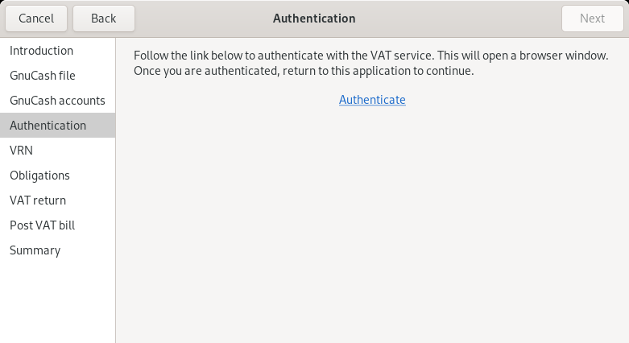
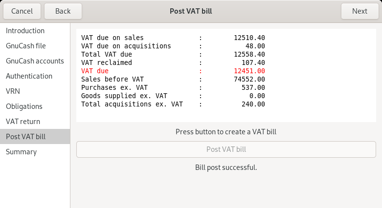

# `gnucash-uk-vat` assist mode

## Introduction

This page describes assist mode which completes a full VAT submission
process, including configuration setup and authentication.  Configuration
and authentication information are cached in the same files that the
CLI uses.

## Usage

```
gnucash-uk-vat --assist
```

The dialog is an assist dialog.  Complete the step, then press Next to continue.

The first screen shows an introduction.


The second screen allows you to select the filename of your GnuCash accounts.


The third screen allows you to select the particular GnuCash accounts
containing VAT records.  See [GnuCash accounts structure](README.md#gnucash-accounts-structure).


The next screen allows you to authenticate with HMRC and store a
credential in `auth.json`.



The next screen allows you to enter your VRN.


The next screen allows you to select a VAT obligation period to submit the
VAT return for.


The next screen shows you the VAT return, and allows you to verify before
submitting.


Optionally, the next screen allows you to post a VAT bill.



The final screen shows a summary of actions taken.


