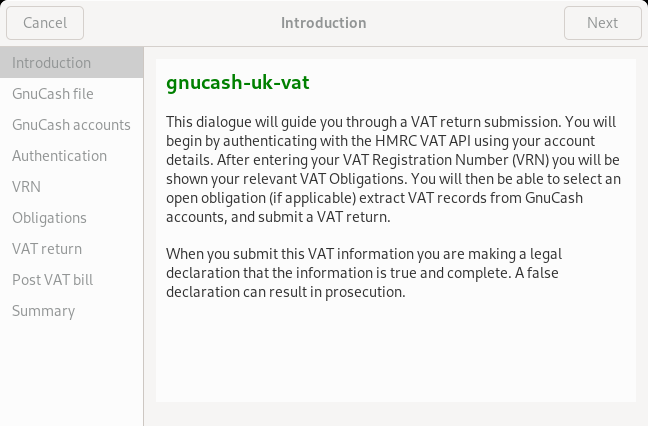

# `gnucash-uk-vat` assist mode

## Introduction

This page describes assist mode which completes a full VAT submission
process, including configuration setup and authentication.  Configuration
and authentication information are cached in the same files that the
CLI uses.

## Usage

```
gnucash-uk-vat --assist
```


!()[screen2.png]
!()[screen3.png]
!()[screen4.png]
!()[screen5.png]
!()[screen6.png]
!()[screen7.png]
!()[screen8.png]
!()[screen9.png]

