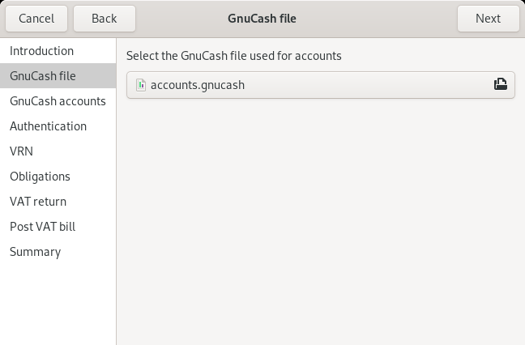
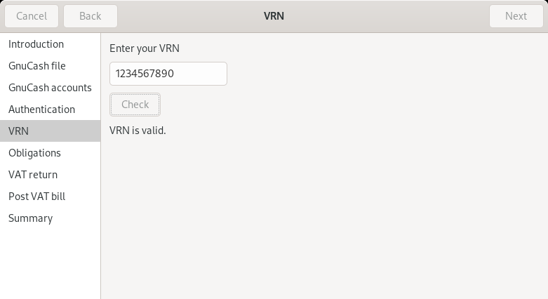
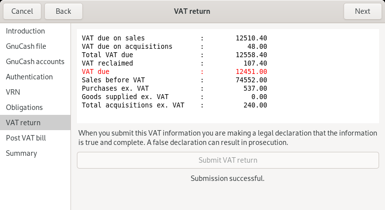
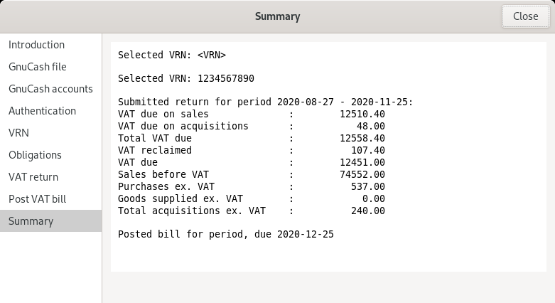

# `gnucash-uk-vat` assist mode

## Introduction

This page describes assist mode which completes a full VAT submission
process, including configuration setup and authentication.  Configuration
and authentication information are cached in the same files that the
CLI uses.

## Usage

```
gnucash-uk-vat --assist
```











